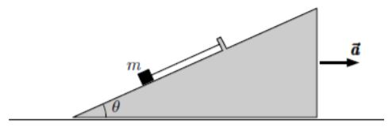

# Verifica del 03-02-2021

## Problema n.1
Un punto materiale di massa m viene lanciato (verso destra) con velocità iniziale v0 sulla guida schematizzata in figura. La guida è costituita da un primo tratto orizzontale e da un secondo tratto costituito da due archi di circonferenza di raggio R=2.00 m di apertura angolare π/3 che si raccordano nel punto P (il primo arco ha la concavità verso l’alto, il secondo verso il basso, vedi figura); la sommità della guida (che è anche il suo punto finale) è anche a quota R dal suolo. La guida è perfettamente liscia e quindi non presenta attriti

- Determinare il minimo valore di v0 che può permettere al corpo di raggiungere la sommità della guida.
- Supporre poi che il corpo venga lanciato con una velocità iniziale pari a (3/2)^1/2 volte quella ottenuta nel punto (a). In tali condizioni calcolare: l’altezza dal suolo a cui il corpo si stacca dalla guida;
- la massima altezza raggiunta dal corpo.

??? check "Visualizza le soluzioni"
    - non ancora disponibile
    - non ancora disponibile
    - non ancora disponibile

??? question "Visualizza lo svolgimento"
    Non ancora disponibile

## Problema n.2
Un corpo di massa m=2.50 kg è appoggiato su un cuneo ed è mantenuto in posizione tramite una corda ideale (inestensibile e di massa trascurabile) con l’altro estremo fissato al cuneo stesso (vedi figura). Il cuneo, la cui superficie piana superiore è inclinata di un angolo θ=30° rispetto all’orizzontale, può scivolare senza attrito sul piano sottostante. Supponendo che il cuneo si muova di moto uniformemente accelerato verso destra (come indicato in figura) con accelerazione di modulo a, determinare:

- i moduli della reazione normale agente sul corpo di massa m e della tensione T della corda, nel caso a=g;
- il minimo valore di a, $a_{min}$, al di sopra del quale il corpo di massa m si stacca dal cuneo.

    
??? check "Visualizza le soluzioni"
    - non ancora disponibile
    - non ancora disponibile
    - non ancora disponibile

??? question "Visualizza lo svolgimento"
    Non ancora disponibile

## Problema n.3
Una sfera omogenea di massa M=30.0 kg è posta in quiete su un piano orizzontale. Ad un certo istante la sfera viene colpita orizzontalmente, lungo la direttrice che passa per il suo centro, da un corpo puntiforme di massa m=200 g che viaggia ad una velocità $v_0=100 \; m/s$. L’urto tra i due è perfettamente elastico e la sfera, durante e dopo l’urto, non slitta sul piano. Determinare i valori che, subito dopo l’urto, avranno le velocità:

- $v_1$ del corpo puntiforme;
- $v_{CM}$ del centro di massa della sfera.
- Inoltre giustificare perché nella risoluzione dei precedenti punti (a) e (b) non è possibile applicare il principio di conservazione della quantità di moto.
    
??? check "Visualizza le soluzioni"
    - non ancora disponibile
    - non ancora disponibile
    - non ancora disponibile

??? question "Visualizza lo svolgimento"
    Non ancora disponibile

## Problema n.4
Un recipiente cilindrico di sezione $S=10^{-2} \; m^2$ è diviso in due parti da un pistone libero di scorrere
senza attriti. Nella parte sinistra (vedi figura) vi sono n=0.6 moli di gas ideale biatomico. Nella
parte destra è stato fatto il vuoto, ed è inserita una molla di costante elastica k=2000 N/m.
Inizialmente il gas è alla temperatura ambiente $T_A=300 K$, e la molla è compressa rispetto alla sua
lunghezza di riposo della quantità $\delta x_A =0.4 m$. Il gas viene riscaldato ponendolo a contatto termico,
attraverso la parete diatermica a sinistra del cilindro, con un serbatoio alla temperatura TB (tutte le
altre pareti del cilindro sono adiabatiche). Il gas si espande (N.B. trasformazione irreversibile) fino
allo stato di equilibrio B in cui la molla è compressa di $\delta x_B=0.9 m$. Il serbatoio viene quindi rimosso,
si blocca il pistone e si attende che si ristabilisca l’equilibrio termico con l’ambiente cosicchè il gas
giunge allo stato C (N.B. trasformazione irreversibile). Infine, rimossa la molla e sbloccato
nuovamente il pistone, si riporta il gas allo stato iniziale A con una compressione isoterma
reversibile. Si determinino:

- il volume iniziale $V_A$ del gas ed il lavoro $W_{AB}$ compiuto dal gas nella trasformazione AB;
- la temperatura $T_B$ del serbatoio ed il calore $Q_{AB}$ scambiato dal gas nella trasformazione AB;
- il calore $Q_{ced}$ ceduto nel ciclo ed il rendimento del ciclo;
- la variazione di entropia dell’universo nella trasformazione AB.

??? check "Visualizza le soluzioni"
    - non ancora disponibile
    - non ancora disponibile
    - non ancora disponibile

??? question "Visualizza lo svolgimento"
    Non ancora disponibile
